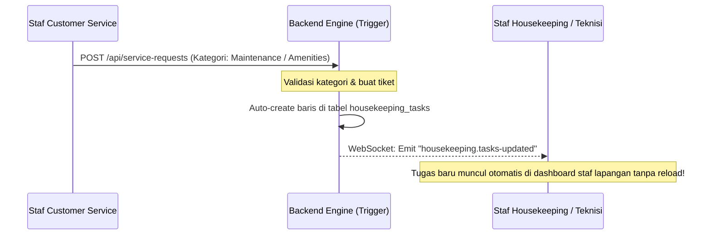

# 🖥️ Hotel Management System (HMS) - Backend Integration Blueprint

Dokumen ini adalah panduan teknis dan acuan bagi tim pengembang Backend untuk membangun layanan API, skema database, dan sistem real-time yang kompatibel dengan antarmuka frontend HMS ini.

---

## 💾 1. Skema Database (Database Schemas)

Untuk mendukung sinkronisasi data operasional hotel secara dinamis, backend direkomendasikan menggunakan database relasional (seperti PostgreSQL atau MySQL) dengan skema tabel sebagai berikut:

### A. Tabel `rooms` (Daftar Kamar)
Menyimpan data fisik kamar hotel beserta status terkini.
```sql
CREATE TABLE rooms (
    id SERIAL PRIMARY KEY,
    room_number VARCHAR(10) UNIQUE NOT NULL,
    type VARCHAR(30) NOT NULL, -- Standard, Deluxe, Suite, Presidential Suite
    status VARCHAR(20) DEFAULT 'available', -- available, occupied, dirty, maintenance
    price DECIMAL(10,2) NOT NULL,
    floor INTEGER NOT NULL,
    guest_name VARCHAR(100) NULL,
    created_at TIMESTAMP DEFAULT CURRENT_TIMESTAMP,
    updated_at TIMESTAMP DEFAULT CURRENT_TIMESTAMP
);
```

### B. Tabel `users` (Manajemen Staf & Hak Akses)
Menyimpan kredensial staf dan hak akses (role).
```sql
CREATE TABLE users (
    nip VARCHAR(30) PRIMARY KEY,
    name VARCHAR(100) NOT NULL,
    role VARCHAR(50) NOT NULL, -- Administrator, Hotel Manager, Front Office, Housekeeping, Customer Service, dll.
    password VARCHAR(255) NOT NULL, -- Hash bcrypt/argon2
    status VARCHAR(20) DEFAULT 'active', -- active, inactive
    created_at TIMESTAMP DEFAULT CURRENT_TIMESTAMP
);
```

### C. Tabel `housekeeping_tasks` (Daftar Penugasan Pembersihan)
Menghubungkan kamar kotor dengan staf housekeeper yang bertugas.
```sql
CREATE TABLE housekeeping_tasks (
    id SERIAL PRIMARY KEY,
    room_number VARCHAR(10) REFERENCES rooms(room_number) ON DELETE CASCADE,
    housekeeper_nip VARCHAR(30) REFERENCES users(nip) ON DELETE SET NULL,
    status VARCHAR(20) DEFAULT 'Assigned', -- Assigned, In_Progress, Completed
    special_requests TEXT,
    cleaning_notes TEXT,
    maintenance_notes TEXT,
    assignment_time TIMESTAMP DEFAULT CURRENT_TIMESTAMP,
    start_time TIMESTAMP NULL,
    completion_time TIMESTAMP NULL,
    duration_minutes INTEGER NULL
);
```

### D. Tabel `service_requests` (Tiket Customer Service & Tamu)
Mengelola keluhan/permintaan tamu dari kamar.
```sql
CREATE TABLE service_requests (
    id SERIAL PRIMARY KEY,
    room_number VARCHAR(10) REFERENCES rooms(room_number) ON DELETE CASCADE,
    item TEXT NOT NULL, -- Deskripsi keluhan (misal: "Minta handuk mandi")
    status VARCHAR(20) DEFAULT 'Pending', -- Pending, On Progress, Resolved
    priority VARCHAR(15) DEFAULT 'Low', -- Low, Medium, Critical
    category VARCHAR(30) NOT NULL, -- Amenities, Maintenance, Food & Beverage, Transportation
    assignee_nip VARCHAR(30) REFERENCES users(nip) ON DELETE SET NULL,
    created_at TIMESTAMP DEFAULT CURRENT_TIMESTAMP,
    resolved_at TIMESTAMP NULL
);
```

---

## 🌐 2. Spesifikasi API Endpoints (RESTful APIs)

Semua endpoint dilindungi menggunakan middleware autentikasi JWT (`Authorization: Bearer <token>`).

### A. Autentikasi (`/api/auth`)
*   `POST /api/auth/login`
    *   **Payload:** `{ "nip": "NIP-CS", "password": "..." }`
    *   **Response:** `{ "token": "...", "user": { "nip": "...", "name": "...", "role": "..." } }`

### B. Manajemen Kamar (`/api/rooms`)
*   `GET /api/rooms` - Mengambil daftar seluruh kamar (beserta status).
*   `PUT /api/rooms/:room_number/status` - Mengubah status kamar secara manual (misal: dari `dirty` ke `available`).
    *   **Payload:** `{ "status": "available" }`

### C. Modul Housekeeping (`/api/housekeeping`)
*   `GET /api/housekeeping/tasks` - List tugas aktif housekeeper (jika peran Staf, filter otomatis berdasarkan NIP login).
*   `POST /api/housekeeping/tasks/distribute` - (Akses: Supervisor) Membagi rata otomatis kamar kotor ke staf yang aktif.
*   `POST /api/housekeeping/tasks/assign` - Penugasan kamar kotor secara manual ke staf tertentu.
*   `PATCH /api/housekeeping/tasks/:id/start` - Mengubah status tugas ke `In_Progress` (Staf mulai bekerja).
*   `PATCH /api/housekeeping/tasks/:id/complete` - Menyelesaikan pembersihan kamar (mengubah kamar terkait menjadi `available`).

### D. Modul Customer Service (`/api/service-requests`)
*   `GET /api/service-requests` - Mengambil daftar tiket keluhan aktif.
*   `POST /api/service-requests` - Membuat tiket keluhan baru.
*   `PATCH /api/service-requests/:id/assign` - Menugaskan tiket ke staf CS tertentu.
*   `PATCH /api/service-requests/:id/resolve` - Menyelesaikan keluhan tamu.

---

## ⚡ 3. Protokol WebSocket & Real-time (WebSocket Contracts)

Untuk menghindari keharusan pengguna me-refresh halaman, backend wajib memancarkan (*broadcast*) event real-time menggunakan **Socket.io** atau **Laravel Echo**:

### A. Event dari Server ke Client (Broadcast)

1.  **`room.status-updated`**
    *   *Kapan dipicu:* Saat status kamar berubah di DB (misal: Front Office check-in tamu -> kamar jadi `occupied`).
    *   *Payload:* `{ "room_number": "101", "status": "occupied" }`
2.  **`housekeeping.tasks-distributed`**
    *   *Kapan dipicu:* Saat Supervisor membagikan tugas pembersihan.
    *   *Payload:* `{ "message": "Tugas baru telah dibagikan", "tasks_count": 5 }`
3.  **`cs.ticket-created`**
    *   *Kapan dipicu:* Staf CS membuat tiket keluhan baru.
    *   *Payload:* `{ "id": 12, "room_number": "205", "item": "AC panas", "priority": "Critical" }`

---

## 🔄 4. Alur Integrasi Lintas Departemen (Cross-Department Flow)

Backend harus secara otomatis menghubungkan data dari modul Customer Service jika kategori tiket memerlukan tindakan fisik di kamar:



*   **Pemicu Otomatis:** Jika `service_requests.category` bernilai `Maintenance` (misal AC bocor, lampu mati) atau `Amenities` (minta bantal/handuk tambahan), Backend wajib langsung membuat baris penugasan di tabel `housekeeping_tasks` agar langsung terbaca di dashboard staf yang bersangkutan.
